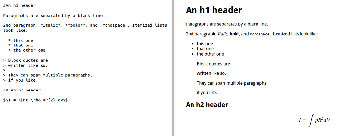

# Description:

This repository contains materials connected with monadic parsers in Haskell and developing source code of parser for markdown documents.

# Tests reports: 

## Status of branch master

## Status of branch dev

## Status of branch `experimental`

